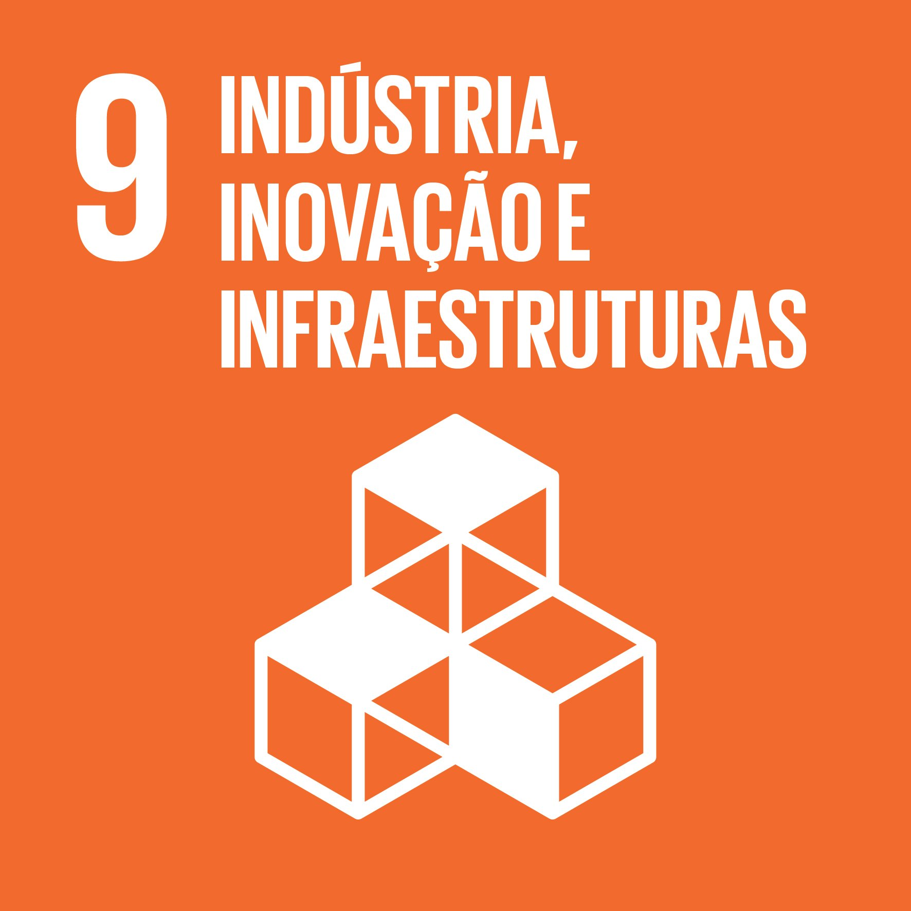
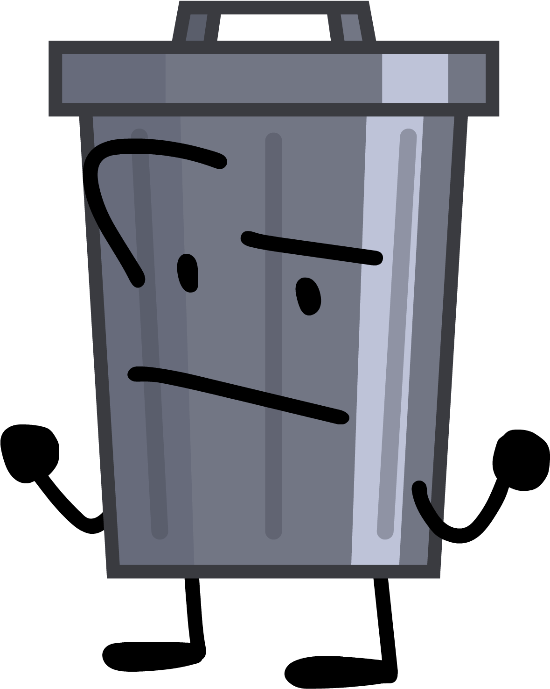
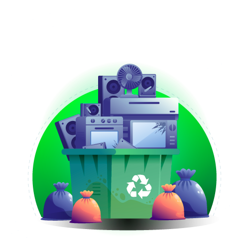
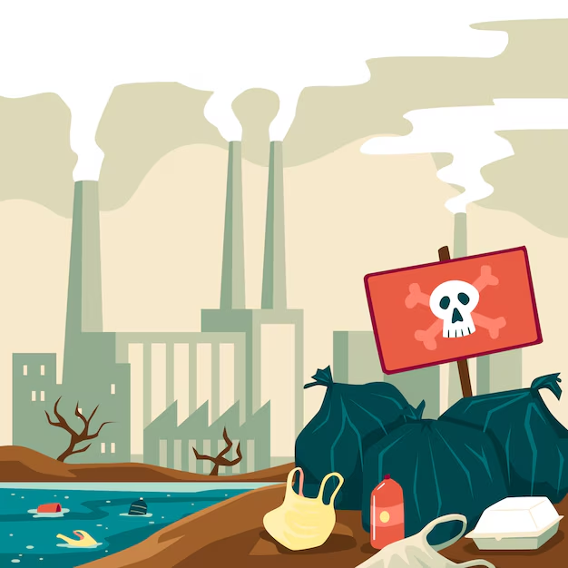

>[!Important]
 > `Repositório - Projetos`
>- Turma: 1° Semestre de Ciência da Computação.
>- Faculdade: Universidade Paulista.
>- Polo: UNIP Marquês.
>- Sobre: Repositório para a documentação do projeto baseada na ODS 9.
>- Membros: Alex Campos de Oliveira, Christian Varandas, Pedro Dias, Rafael Torso.


> [!NOTE]
>- HTML


```csharp
<!DOCTYPE html>
<html lang="pt-br">
<head>
    <meta charset="UTF-8">
    <meta name="viewport" content="width=device-width, initial-scale=1.0">  <!-- Viewport: Porta de Visualização. width = device-width: Largura do dispositivo sendo utilizado. A escala inicial é 100% (1.0). -->
    <title>Project</title>
    <link rel= "stylesheet" href= "CSS/Style.css" >
</head>

<body>
    <div id = "Wrapper">
        
    <header>
        <h1 id = "ODS9"> A ODS 9</h1>

<div id = "Topics">
        <section> 
            <a href= "#Introduction" class = "STitle">Início </a>
        </section>

        <section> 
            <a href= "#AboutODS" class = "STitle"> ODS </a>
        </section>

        <section> 
            <a href= "#Problem" class = "STitle"> Problema </a> 
        </section>
</div>

    </header>

    <main>
        <div class = "ContentType1" id = "Introduction"> 
        <div> 
            <h1 class = "Title" id = "IntTitle"> Indústria, Inovação e Infraestrutura</h1>  
            <p class = "Text" id = "IntTitle"> O descarte do lixo eletrônico e sua relação com a ODS 9.</p>
        </div>
           <a href = "https://www.ipea.gov.br/ods/ods9.html">  </a> 
        </div>


        <div class = "ContentType1" id = "AboutODS"> 
        <div> 
            <h1 class = "Title"> O que são as ODS?</h1>
            <p class = "Text"> Os Objetivos de Desenvolvimento Sustentável (ODS) são 17 objetivos globais, estabelecidos como parte da Agenda 30, visando abordar desafios sociais, econômicos e ambientais que ocorrem no mundo todo. Cada um desses objetivos possui uma meta que deve ser alcançada até o ano de 2030.</p>
        </div>
            <a href = "https://brasil.un.org/pt-br/sdgs">  </a>
        </div>

                <div class = "ContentType1" id = "AbODS9"> 
        <div> 
            <h1 class = "Title"> ODS 9 </h1>
            <p class = "Text"> O Objetivo de Desenvolvimento Sustentável 9 é intitulado como Indústria, Inovação e Infraestrutura se baseia na visão de impulsionar o progresso socioeconômico global e no Brasil. Esse objetivo enfrenta a relação entre os problemas climáticos e o crescimento industrial. Pois o crescimento industrial impulsiona o progresso, porém gera emissões de gases de efeito estufa e outros impactos ambientais, o que exige medidas para reduzir os danos e garantir sustentabilidade. </p>
        </div>
           <a href = "https://www.ipea.gov.br/ods/ods9.html">  </a>
        </div>

                <div class = "ContentType1" id = "Problem"> 
        <div> 
            <h1 class = "Title"> O Problema </h1>
            <p class = "Text"> O lixo eletrônico é composto por materiais de origem inorgânica, os quais podem afetar negativamente o meio ambiente, visto que são compostos por elementos poluentes, sendo absorvidos pelo solo e pelos lençois freáticos. </p>
            <p class = "Text"> O contato com esses produtos, além de ser prejudicial ao ambiente, pode também comprometer a saúde de pessoas e animais que entrarem em contato, causando diversas doenças. </p>
            <p class = "Text"> Dentre as substâncias tóxicas que se encontram nesses dispositivos, estão o chumbo, encontrado em baterias e soldas, o qual pode causar danos ao sistema nervoso. O mercúrio, presente em lâmpadas fluorescentes e circuitos eletrônicos, pode afetar o sistema nervoso e renal. O cádmio é encontrado em baterias recarregáveis, reconhecido como carcinogênico, podendo causar danos aos rins e pulmões. Também os bifenilos policlorados (PCBs) em equipamentos eletrônicos, são persistentes no meio ambiente, podendo causar impactos sérios à saúde e à fauna. </p>
            <p class = "Text"> Alguns exemplos do que pode ser considerado lixo eletrônico são: Computadores, celulares, tablets, monitores, teclados, aparelhos de som, câmeras, etc. </p> 
            <p class = "Text"> O Brasil é o quinto maior produtor de lixo eletrônico no mundo, gerando em média 2,4 milhões de toneladas anuais. A melhor forma de reciclagem destes resíduos é desmontá-los, destinando cada parte para o local correto. Das inúmeras toneladas produzidas no país, apenas uma pequena parte é direcionada corretamente neste processo. Há uma lei no país que exige que os produtores recolham seus produtos </p>
        </div>

          <a href = "https://www.todamateria.com.br/tipos-de-lixo/">  </a>
        </div>

        <div class = "ContentType1" id = "CCS"> 
            <div id= "Cause">
            <a href = "https://brasilescola.uol.com.br/geografia/lixo.htm">  </a>
            <h1 class = "Title"> Causa </h1>
            <p class = "Text"> O aumento da globalização e da tecnologia faz com que os lançamentos sejam constantes, novos aparelhos são lançados em curtos períodos de tempo, induzindo as pessoas a abandonarem os seus antigos. Consequentemente, estes são descartados aos montes, gerando uma grande quantidade de lixo eletrônico. </p>
           </div>

            <div id= "Consequence">
            <h1 class = "Title"> Consequência </h1>
            <p class = "Text" id = "FirstP"> O contato com esses produtos, além de ser prejudicial ao ambiente, pode também comprometer a saúde de pessoas e animais que entrarem em contato, causando diversas doenças. </p>
            <p class = "Text"> Dentre as substâncias tóxicas que se encontram nesses dispositivos, estão o chumbo, encontrado em baterias e soldas, o qual pode causar danos ao sistema nervoso. O mercúrio, presente em lâmpadas fluorescentes e circuitos eletrônicos, pode afetar o sistema nervoso e renal. O cádmio é encontrado em baterias recarregáveis, reconhecido como carcinogênico, podendo causar danos aos rins e pulmões. Também os bifenilos policlorados (PCBs) em equipamentos eletrônicos, são persistentes no meio ambiente, podendo causar impactos sérios à saúde e à fauna. </p>
            <a href = "https://brasilescola.uol.com.br/biologia/poluicao.htm">  </a>
            </div>

            <div id= Soluction>
            <a href = "https://www.todamateria.com.br/o-que-e-ecologia/">  </a>
            <h1 class = "Title"> Solução </h1>
            <p class = "Text" id = "FirstP"> A forma mais eficaz de reduzir drasticamente a quantidade de lixo eletrônico é a reciclagem. Muitas empresas atualmente possuem seus próprios centros de reciclagem, onde reutilizam os aparelhos antigos para criar os novos. Por isso, elas recebem os aparelhos antigos de seus clientes, entregá-los às suas respectivas empresas é uma forma de descarte. </p>
            <p class = "Text"> A gestão destes resíduos é regulamentada por lei, promovendo práticas sustentáveis. A Política Nacional de Resíduos Sólidos (Lei n.º 12.305/2010) estabelece as diretrizes necessárias. </p>
            </div>
        </div>

    </main>

    <footer>

    </footer>

    </div>
</body>

<script src = "JS/Main.JS"> </script>
</html>
```

> [!NOTE]
>- CSS

```csharp
body{
    background-color: rgb(0, 0, 0);
    margin: 0;
    padding: 0;
}

header{
    background-color: #F58041;
    display: flex;
    justify-content: space-between;
}

#ODS9{
    padding-left: 20px;
}

#Wrapper{
    background-color: rgb(0, 0, 0);
    width: 100%;
    height: 100%; 
}

#Topics{
    padding-right: 20px;
    gap: 20px;
    display: flex;
    align-items: center;
}

.STitle{
    font-size: 25px;
    font-weight: bold;
    text-decoration: none;    
    color: black;
}

.ContentType1{ /* Classe base para as divs. Determina um "Grid" base para que seja possível mudar a disposição dos elementos facilmente. */
    display: grid; /* Torna a disposição da Div para o tipo "Grid" - similar à uma tabela. */
    grid-template-columns: 1fr 1fr; /* O template da div será dividido em duas colunas e 1 linha. */
    background-color: #191818; 
    align-content: center;
    height: 636px;
    padding: 20px;
}

#Introduction img{
    grid-column: 2;
}

#AbODS9{
    height: 100%;
}

.Imgs{
    display: flex;
    justify-self: center; /* centraliza horizontalmente na coluna 2 */
    align-content: center;
    width: 400px;
    height: 400px;
}

#AbODS9 img{
    padding: 20px;
    grid-row: 1;
    grid-column: 1;
}

#AbODS9 h1{
    grid-row: 1;
    grid-column: 2;
}

#AboutODS, #AbODS9{
    height: 600px;
    background-color:#455681;
}

#Problem{
    padding: 20px;
    background-color: #B79B82;
    align-items: center;
}

#IntTitle{
    color: white;
    font-weight: 20px;
    font-size: 35px;    
}
#IntText{
    color: rgb(150, 139, 139);
    font-size: 20px;
    font-weight: normal;
}

.Title{
    color:black;
    font-weight: 20px;
    font-size: 35px;
}
.Text{
    font-size: 20px;
    font-weight: normal;
}

/* Organização da última DIV com Grid. */

#CCS{
  display: grid;
  justify-items: center;
  grid-template-columns: 1fr 1fr 1fr; /* Cria 3 colunas */
  grid-template-rows: auto auto;  /* Cria 2 linhas */
  padding: 20px;
  height: 1077px;
  background-color: #469A50;
}

#CCS img{
  padding: 20px;
  width: 300px;
  height: 300px;
}

#Cause{
  width: 300px;
  grid-column: 1;
  grid-row: 1;
}

#Consequence{
  width: 300px;
  grid-column: 2;
  grid-row: 1;
}


#Soluction{
  width: 300px;
  grid-column: 3;
  grid-row: 1;
}

 /* Medias Queries para responsividade. */

@media (max-width: 1120px) and (min-width: 800px){ /* Diminui levemente a fonte acompanhando a diminuição do tamanho de tela */
#Problem .Text{
    font-size: 15px;
}
}

@media (max-width: 800px) and (min-width: 0px){ /* Altera SOMENTE o CCS, vulgo, divisão final do site. Inclui um período entre 800-0. */
.Imgs{  /* Diminuição do tamanho das imagens */
    width: 200px; 
    height: 200px;
}
.Title{
    font-size: 15px; /* Diminuição do tamanho dos títulos */
}
.Text{
    font-size: 15px; /* Diminuição do tamanho dos textos */
}

#AboutODS, #AbODS9{ /* Diminuição de 2 Divs para que não haja um espaço enorme sem conteúdo. */
    height: 400px;
    background-color:#455681;
}

    
#Problem .Text{
    font-size: 10px; /* Diminuição do tamanho de fonte da div #Problem. */
}

#CCS{ 
  grid-template-columns: 1fr; /* Faz a disposição dos conteúdos serem na vertical ao criar uma coluna única */
  grid-template-rows: auto auto auto; /* A coluna possuirá 3 linhas. */

  padding: 20px;
  height: 1077px;
  background-color: #469A50;
}

#CCS .Text{
        font-size: 10px; /* Diminuição do tamanho dos textos */
}

/* Diminui a altura da imagem da Div CCS para que não fuja do tamanho limite devido às outras alterações do site. */
#CCS img{
    width: 200px;
    height: 120px;
}

#Cause{ /* Possui um grid próprio para reposicionar as imagens */
  display: grid; 
  grid-template-rows: auto auto auto;
  grid-column: 1;
  grid-row: 1;
}

/* Guia os elementos da div */
#Cause h1{
    grid-row: 1;
}

#Cause p{
    grid-row: 2;
}

#Cause img{
    grid-row: 3;
}

#Consequence{ /* Possui um grid próprio para reposicionar as imagens */
  display: grid;
  grid-template-rows: auto auto auto auto;
  grid-column: 1;
  grid-row: 2;
}

/* Guia os elementos da div */
#Consequence h1{
    grid-row: 1;
}

#Consequence #FirstP{
    grid-row: 2;
}

#Consequence p{
    grid-row: 3;
}

#Consequence img{
  grid-column: 1;
  grid-row: 3;
}


#Soluction{ /* Possui um grid próprio para reposicionar as imagens */
  display: grid;
  grid-template-rows: auto auto auto auto;
  grid-column: 1;
  grid-row: 3;
}

/* Guia os elementos da div */
#Soluction h1{
    grid-row: 1;
}

#Soluction #FirstP{
    grid-row: 2;
}

#Soluction p{
    grid-row: 3;
}

#Soluction  img{
  grid-column: 1;
  grid-row: 3;
}

@media (max-width: 450px) and (min-width: 320px){  /* Basicamente, sobrepõe os valores do media que vai de 800 até 0, quando entrar no período 450-320. */

#AboutODS, #AbODS9{ /* Diminuição de 2 Divs para que não haja um espaço enorme sem conteúdo. */
    height: 200px;
    background-color:#455681;
}

.Imgs{  /* Diminuição do tamanho das imagens */
    width: 100px; 
    height: 100px;
}
.Title{
    font-size: 12px; /* Diminuição do tamanho dos títulos */
}
.Text{
    font-size: 9px; /* Diminuição do tamanho dos textos */
}
#Problem .Text{
    font-size: 9px; /* Diminuição do tamanho de fonte da div #Problem. */
}
}

}
```

> [!NOTE]
> Apresentação <br>
> 


> [!NOTE]
> Site <br>
> https://youtu.be/rDx3Yt6CnYs?si=oMuahA0fa3-T4Ymz
